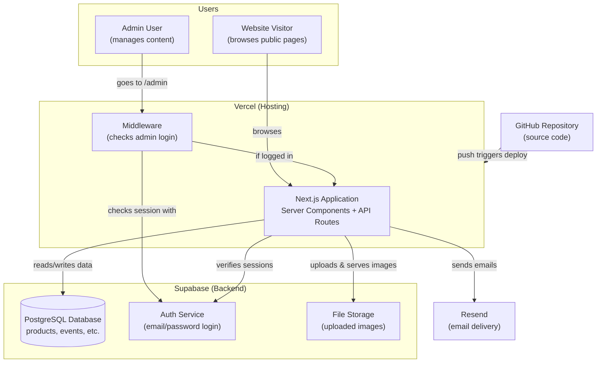
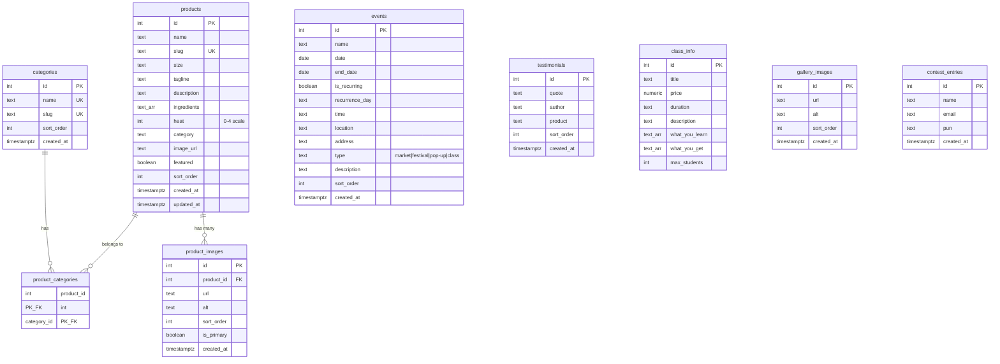
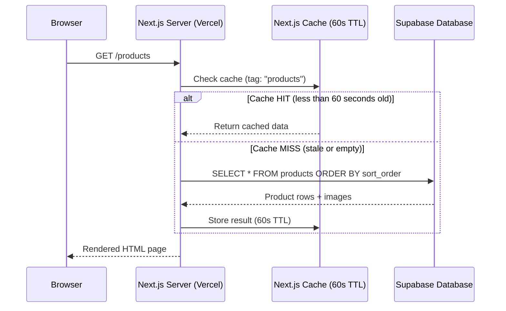
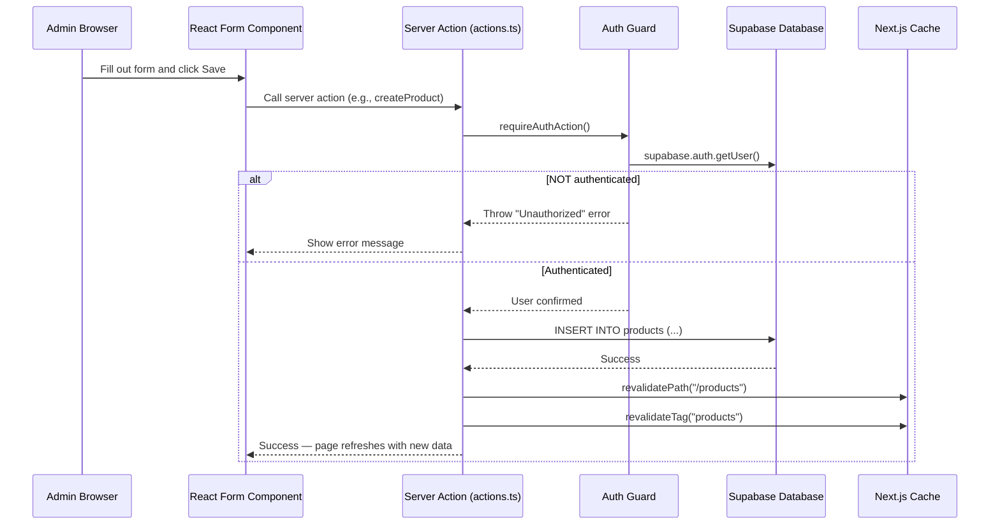
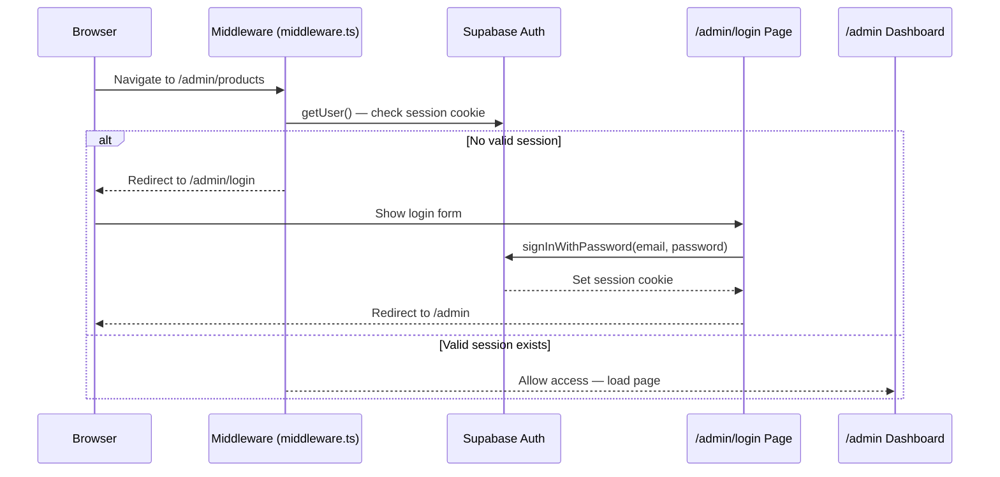
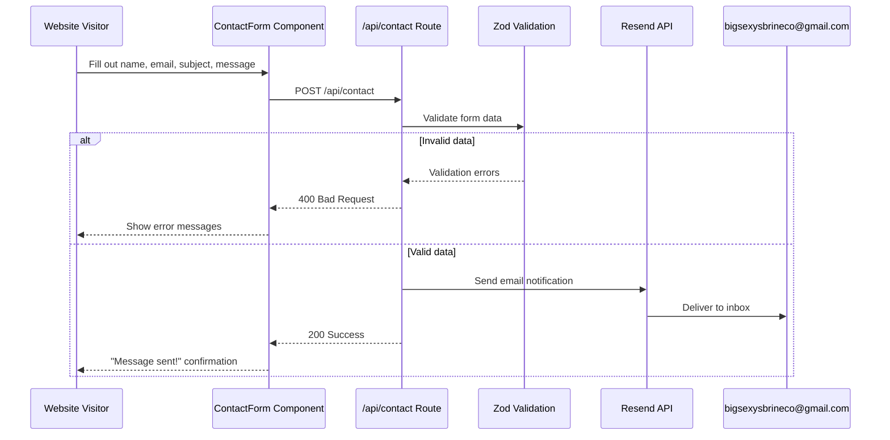
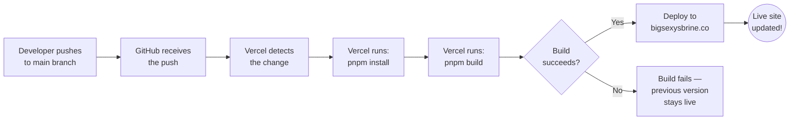

# Big Sexy's Brine Co.

**Small-batch artisan preserved foods — handcrafted in Wheat Ridge, Colorado.**

     

| | URL |
|---|---|
| **Live Site** | [bigsexysbrine.co](https://bigsexysbrine.co) |
| **Admin Dashboard** | [bigsexysbrine.co/admin](https://bigsexysbrine.co/admin) |
| **Repository** | [github.com/nkulavic/big-sexys-brine-co](https://github.com/nkulavic/big-sexys-brine-co) |

---

## Table of Contents

- [What Is This Project?](#what-is-this-project)
- [Glossary of Terms](#glossary-of-terms)
- [Architecture Overview](#architecture-overview)
- [Tech Stack](#tech-stack)
- [Project Structure](#project-structure)
- [Getting Started](#getting-started)
- [Environment Variables & Secrets](#environment-variables--secrets)
- [Database Schema](#database-schema)
- [How the App Works](#how-the-app-works)
- [Deployment](#deployment)
- [Making Changes — Developer Workflow](#making-changes--developer-workflow)
- [Using Claude Code](#using-claude-code)
- [Common Tasks Reference](#common-tasks-reference)
- [Troubleshooting](#troubleshooting)

---

## What Is This Project?

This is the website for **Big Sexy's Brine Co.**, an artisan pickle and preserved foods company. The site has two sides:

### The Public Website (what customers see)

- **Homepage** — hero banner, featured products, testimonials, upcoming events, Instagram link
- **The Lineup** (`/products`) — full product catalog with category filtering and heat-level indicators
- **Product Detail** (`/products/spicy-pickles`) — individual product pages with image carousels, ingredients, and heat level
- **The Story** (`/about`) — brand story and company values
- **Find Us** (`/events`) — upcoming farmers markets, festivals, pop-ups, and classes
- **Take a Class** (`/learn-to-preserve`) — info about hands-on brining workshops
- **Behind the Jars** (`/gallery`) — behind-the-scenes photo gallery
- **Win a Jar!** (`/contest`) — pickle pun contest entry form
- **Say Hello** (`/contact`) — contact form for inquiries and custom orders

### The Admin Dashboard (what the business owner uses)

A password-protected area at `/admin` where the owner can:

- Add, edit, delete, and reorder **products** (with image uploads and rich text descriptions)
- Manage **events** (including recurring weekly markets)
- Manage **testimonials** from customers
- Upload and manage **gallery images**
- Edit **class info** (pricing, curriculum, capacity)
- Manage product **categories**

> **This is NOT an e-commerce site.** There is no shopping cart or checkout. It is a product catalog and information site. All content is managed through the admin dashboard — you do not need to edit code to update products, events, or testimonials.

---

## Glossary of Terms

If you are new to web development, here is what every key term in this project means:

| Term | What It Means |
|------|---------------|
| **Next.js** | A framework built on top of React for building websites. It handles routing (URLs → pages), server-side rendering, and deployment. Think of it as the skeleton of the website. |
| **React** | A JavaScript library for building user interfaces out of reusable "components" — small, self-contained pieces of UI like a button, a product card, or a header. |
| **TypeScript** | JavaScript with added "types." It catches errors before you run your code by making you declare what kind of data variables hold (e.g., `name` is a `string`, `price` is a `number`). |
| **Supabase** | An open-source backend service. It provides a PostgreSQL database (stores data), user authentication (login system), and file storage (image uploads) — all in one. |
| **PostgreSQL** | A powerful relational database. Think of it as a collection of spreadsheets (called "tables") that can reference each other. Supabase runs PostgreSQL for us. |
| **Tailwind CSS** | A CSS framework where you style elements by adding class names directly in your HTML/JSX (e.g., `className="text-red-500 font-bold"`) instead of writing separate CSS files. |
| **shadcn/ui** | A collection of pre-built, customizable UI components (buttons, cards, forms, dialogs). The components are copied into your project at `src/components/ui/` — they are not an external dependency. |
| **Resend** | An email delivery service. The website uses it to send contact form and contest entry notification emails. |
| **Vercel** | A hosting platform built by the creators of Next.js. When you push code to GitHub, Vercel automatically builds and deploys the site. |
| **pnpm** | A fast, disk-space-efficient package manager (like npm or yarn). It installs the libraries your project depends on. |
| **App Router** | Next.js's routing system where folders inside `src/app/` become URL paths. For example, `src/app/(public)/about/page.tsx` becomes the `/about` page. |
| **Server Component** | A React component that runs on the server, not in the user's browser. It can directly query databases and never sends its code to the browser. This is the default in Next.js. |
| **Client Component** | A React component that runs in the user's browser. Needed for interactive features (button clicks, form inputs, animations). Marked with `"use client"` at the top of the file. |
| **Server Action** | A function marked with `"use server"` that runs on the server but can be called from the browser. Used for form submissions and database writes (create, update, delete). |
| **Row Level Security (RLS)** | A Supabase/PostgreSQL feature that controls who can read or write each row of data. In this project: anyone can read, but only logged-in admin users can write. |
| **Middleware** | Code that runs BEFORE a page loads. This project uses it to check if a user is logged in before allowing access to `/admin` pages. |
| **Environment Variable** | A configuration value (like an API key or database URL) stored outside the code in a `.env.local` file. These are secrets that should never be committed to git. |
| **Revalidation** | The process of clearing cached data so the website shows fresh content. When an admin creates or edits a product, the cache is cleared so visitors see the updated data. |
| **API Route** | A server-side endpoint (like `/api/contact`) that handles HTTP requests. In this project, API routes process form submissions and send emails. |
| **Slug** | A URL-friendly version of a name. For example, the product "Spicy Pickles" has the slug `spicy-pickles`, making its URL `/products/spicy-pickles`. |

---

## Architecture Overview

Here is how all the pieces of this project connect:



**How to read this diagram:**

- **Website Visitor** browses the public pages. The Next.js app fetches product, event, and testimonial data from the Supabase database and renders the pages.
- **Admin User** navigates to `/admin`. The **Middleware** intercepts the request and checks with Supabase Auth whether the user is logged in. If not, they are redirected to the login page.
- When an admin uploads product images, they go to **Supabase Storage**. When a visitor submits the contact form, the app sends an email via **Resend**.
- When a developer pushes code to **GitHub**, Vercel automatically detects the change, builds the project, and deploys it to `bigsexysbrine.co`.

---

## Tech Stack

Every technology used in this project, what it does, and where to learn more:

| Technology | Version | What It Does in This Project | Documentation |
|---|---|---|---|
| **Next.js** | 16.1.6 | Web framework — handles page routing, server rendering, and API routes | [nextjs.org/docs](https://nextjs.org/docs) |
| **React** | 19.2.3 | UI library — every page is built from React components | [react.dev](https://react.dev) |
| **TypeScript** | 5.9.3 | Adds type safety to JavaScript — catches bugs before the code runs | [typescriptlang.org](https://www.typescriptlang.org) |
| **Supabase** | 2.99.1 | Database (PostgreSQL), user authentication, and image storage — all-in-one backend | [supabase.com/docs](https://supabase.com/docs) |
| **Tailwind CSS** | v4 | Utility-first CSS — style elements with class names like `text-red-500 font-bold` | [tailwindcss.com](https://tailwindcss.com) |
| **shadcn/ui** | New York style | Pre-built UI components (Button, Card, Dialog, Table, etc.) copied into `src/components/ui/` | [ui.shadcn.com](https://ui.shadcn.com) |
| **Resend** | 6.9.3 | Sends emails when someone submits the contact form or contest entry | [resend.com/docs](https://resend.com/docs) |
| **React Hook Form** | 7.71.2 | Manages form state and handles submissions efficiently | [react-hook-form.com](https://www.react-hook-form.com) |
| **Zod** | 4.3.6 | Validates data — ensures form inputs are the right type and format | [zod.dev](https://zod.dev) |
| **Framer Motion** | 12.35.0 | Adds animations and smooth transitions to page elements | [motion.dev](https://motion.dev) |
| **Embla Carousel** | 8.6.0 | Powers the product image carousels (swipeable slideshows) | [embla-carousel.com](https://www.embla-carousel.com) |
| **TipTap** | 3.20.5 | Rich text editor (like a mini Word processor) used in admin forms for product descriptions | [tiptap.dev](https://tiptap.dev) |
| **dnd-kit** | 6.3.1 | Drag-and-drop functionality for reordering products, events, and testimonials in the admin | [dndkit.com](https://dndkit.com) |
| **Lucide React** | 0.577.0 | Icon library — provides all the icons used throughout the site | [lucide.dev](https://lucide.dev) |
| **pnpm** | (lockfile) | Package manager — installs and manages project dependencies | [pnpm.io](https://pnpm.io) |

> **What is "utility-first CSS"?** Instead of writing a separate CSS file with rules like `.title { color: red; font-size: 24px; }`, Tailwind lets you write `className="text-red-500 text-2xl"` directly on the element. It feels unusual at first, but it keeps styles co-located with the components that use them.

> **How does shadcn/ui work?** Unlike most component libraries that you install as a package, shadcn/ui components are copied directly into your project at `src/components/ui/`. This means you own the code and can customize it freely. The `components.json` file at the project root configures how shadcn generates components.

---

## Project Structure

```
big-sexys-brine-co/
│
├── public/                              # Static files served as-is (images, icons, manifest)
│   ├── images/
│   │   ├── gallery/                     # Behind-the-scenes photos for /gallery
│   │   ├── logo/                        # Brand logos (transparent, cutout)
│   │   └── products/                    # Product photos (spicy-pickles.jpg, garlic.jpg, etc.)
│   ├── manifest.json                    # PWA manifest (app name, icons)
│   └── instagram-qr.png                # QR code linking to Instagram
│
├── src/                                 # All application source code
│   ├── app/                             # Next.js App Router — folders = URL paths
│   │   │
│   │   ├── (public)/                    # PUBLIC PAGES (the parentheses are a "route group")
│   │   │   ├── layout.tsx               # Wraps ALL public pages with Header + Footer
│   │   │   ├── page.tsx                 # Homepage — bigsexysbrine.co/
│   │   │   ├── about/page.tsx           # /about — "The Story"
│   │   │   ├── contact/page.tsx         # /contact — contact form
│   │   │   ├── contest/page.tsx         # /contest — pickle pun contest
│   │   │   ├── events/page.tsx          # /events — farmers markets & festivals
│   │   │   ├── gallery/page.tsx         # /gallery — photo gallery
│   │   │   ├── learn-to-preserve/       # /learn-to-preserve — class info
│   │   │   │   └── page.tsx
│   │   │   └── products/
│   │   │       ├── page.tsx             # /products — product catalog with filters
│   │   │       └── [slug]/page.tsx      # /products/spicy-pickles — dynamic product page
│   │   │
│   │   ├── admin/                       # ADMIN DASHBOARD (protected by middleware)
│   │   │   ├── layout.tsx               # Admin layout with sidebar navigation
│   │   │   ├── page.tsx                 # /admin — dashboard with stats overview
│   │   │   ├── login/page.tsx           # /admin/login — email/password login form
│   │   │   ├── actions.ts              # ALL server actions for CRUD operations
│   │   │   ├── products/                # /admin/products — product management
│   │   │   │   ├── page.tsx             #   List all products (sortable)
│   │   │   │   ├── new/page.tsx         #   Create a new product
│   │   │   │   └── [id]/edit/page.tsx   #   Edit an existing product
│   │   │   ├── categories/page.tsx      # /admin/categories — manage categories
│   │   │   ├── events/                  # /admin/events — event management
│   │   │   ├── testimonials/            # /admin/testimonials — testimonial management
│   │   │   ├── gallery/page.tsx         # /admin/gallery — image management
│   │   │   └── class/page.tsx           # /admin/class — edit class info
│   │   │
│   │   ├── api/                         # API ROUTES (server-side endpoints)
│   │   │   ├── contact/route.ts         # POST /api/contact — sends email via Resend
│   │   │   ├── contest/route.ts         # POST /api/contest — saves to DB + sends email
│   │   │   └── email/inbound/route.ts   # POST /api/email/inbound — Resend webhook
│   │   │
│   │   ├── layout.tsx                   # ROOT LAYOUT — fonts, metadata, <html> tag
│   │   ├── globals.css                  # Global styles, brand colors, Tailwind theme
│   │   ├── robots.ts                    # Generates robots.txt for search engines
│   │   └── sitemap.ts                   # Generates sitemap.xml for search engines
│   │
│   ├── components/                      # Reusable React components
│   │   ├── admin/                       # Admin-only: forms, sidebar, image upload, sortable lists
│   │   ├── forms/                       # Public forms: ContactForm, ContestForm
│   │   ├── gallery/                     # GalleryGrid component
│   │   ├── layout/                      # Header, Footer, Container
│   │   ├── products/                    # ProductCard, ProductGrid, HeatIndicator, ImageCarousel
│   │   ├── seo/                         # JSON-LD structured data for search engines
│   │   └── ui/                          # shadcn/ui primitives (button, card, dialog, input, etc.)
│   │
│   ├── content/                         # Static JSON data (fallback when Supabase is not configured)
│   │   ├── products.json                # 15 products with all fields
│   │   ├── events.json                  # Sample events
│   │   ├── testimonials.json            # Sample testimonials
│   │   └── class.json                   # Class info (price, duration, curriculum)
│   │
│   ├── lib/                             # Utility functions and service clients
│   │   ├── data.ts                      # Data fetching layer (getProducts, getEvents, etc.)
│   │   ├── utils.ts                     # Helper utilities (cn function for class merging)
│   │   └── supabase/
│   │       ├── client.ts                # Browser-side Supabase client
│   │       ├── server.ts                # Server-side Supabase client + service role client
│   │       ├── middleware.ts            # Session refresh logic for auth cookies
│   │       └── auth-guard.ts            # requireAuth() and requireAuthAction() helpers
│   │
│   ├── types/
│   │   └── index.ts                     # TypeScript interfaces (Product, Event, ClassInfo, etc.)
│   │
│   └── middleware.ts                    # Next.js middleware — protects /admin/* routes
│
├── supabase/                            # Database configuration
│   ├── schema.sql                       # Full database schema (tables, RLS policies, indexes)
│   ├── seed.sql                         # Initial data for all tables
│   └── config.toml                      # Supabase CLI local dev configuration
│
├── .env.example                         # Template for environment variables (safe to commit)
├── package.json                         # Dependencies and npm scripts
├── pnpm-lock.yaml                       # Exact dependency versions (do NOT edit manually)
├── tsconfig.json                        # TypeScript configuration
├── next.config.ts                       # Next.js configuration (image remote patterns)
├── postcss.config.mjs                   # PostCSS config (required by Tailwind)
├── eslint.config.mjs                    # ESLint code quality rules
├── components.json                      # shadcn/ui code generation configuration
└── agents.md                            # Setup instructions for AI coding assistants
```

### Key Concepts in the File Tree

**`(public)` — Route Group:**
The parentheses in `(public)` create a "route group." This groups pages together so they share a layout (Header + Footer) without adding `public` to the URL. The page at `src/app/(public)/about/page.tsx` becomes `/about`, not `/public/about`.

**`[slug]` — Dynamic Route:**
Square brackets mean "this part of the URL is a variable." The file `src/app/(public)/products/[slug]/page.tsx` handles ANY product URL. When someone visits `/products/spicy-pickles`, the `slug` variable equals `"spicy-pickles"`, and the page fetches that product's data.

**`layout.tsx` vs `page.tsx`:**
- `page.tsx` = the actual content of a page (what you see)
- `layout.tsx` = a wrapper that goes around pages. The public layout adds the Header and Footer. The admin layout adds the sidebar. Layouts persist across page navigations (they don't re-render).

**`route.ts` — API Endpoints:**
Files named `route.ts` (not `page.tsx`) are API endpoints. They handle HTTP requests (like form submissions) and return JSON responses instead of HTML pages.

**`"use client"` Directive:**
By default, all components in Next.js are Server Components (they run on the server). If a component needs interactivity — button clicks, form inputs, animations, browser APIs — it must have `"use client"` as the very first line of the file. This tells Next.js to also send the component's JavaScript to the browser.

---

## Getting Started

Follow these steps to get the project running on your computer.

### Prerequisites

Before you begin, make sure you have:

| Requirement | Why You Need It | How to Check / Install |
|---|---|---|
| **Node.js 18+** | The JavaScript runtime that executes the project on your machine | `node --version` — install from [nodejs.org](https://nodejs.org) |
| **pnpm** | The package manager this project uses to install libraries | `pnpm --version` — install with `npm install -g pnpm` |
| **Git** | Version control — tracks code changes and syncs with GitHub | `git --version` — install from [git-scm.com](https://git-scm.com) |
| **A GitHub account** | To clone (download) the repository | [github.com](https://github.com) |
| **A Supabase account** | Free tier is sufficient — provides the database, auth, and image storage | [supabase.com](https://supabase.com) |
| **A Resend account** (optional) | Only needed if you want the contact form to actually send emails. Without it, submissions log to the terminal console instead. | [resend.com](https://resend.com) |

### Step 1: Clone the Repository

"Cloning" downloads a copy of the code from GitHub to your computer.

```bash
git clone https://github.com/nkulavic/big-sexys-brine-co.git
cd big-sexys-brine-co
```

### Step 2: Install Dependencies

This reads `package.json` and downloads all the libraries the project needs into a `node_modules/` folder. It may take a minute.

```bash
pnpm install
```

### Step 3: Set Up Environment Variables

Copy the template file to create your local environment file:

```bash
cp .env.example .env.local
```

> **What is `.env.local`?** It is a file that holds secret values (API keys, database URLs) that should never be shared publicly. It is listed in `.gitignore`, so git will never commit it.

You will fill in the actual values after setting up Supabase (Step 4). See the [Environment Variables & Secrets](#environment-variables--secrets) section for details on each variable.

### Step 4: Set Up the Supabase Database

1. Go to [supabase.com](https://supabase.com) and create a new project (the free tier works fine)
2. Wait for the project to finish provisioning (about 1 minute)
3. Open the **SQL Editor** (left sidebar in the Supabase dashboard)
4. Open the file `supabase/schema.sql` from this project, copy its entire contents, paste it into the SQL Editor, and click **Run**. This creates all the database tables and security policies.
5. Open the file `supabase/seed.sql`, copy its entire contents, paste it into the SQL Editor, and click **Run**. This populates the tables with initial product, event, testimonial, and class data.

### Step 5: Create the Storage Bucket

Product images and gallery photos are stored in Supabase Storage.

1. In the Supabase dashboard, go to **Storage** (left sidebar)
2. Click **New Bucket**
3. Name it `images`
4. Toggle **Public bucket** to ON (so images can be loaded by the website)
5. Click **Create bucket**

Then add a storage policy so authenticated users can upload files:

1. Click the `images` bucket
2. Go to the **Policies** tab
3. Click **New Policy** → **For full customization**
4. Policy name: `Allow authenticated uploads`
5. Allowed operations: SELECT, INSERT, UPDATE, DELETE
6. Target roles: `authenticated`
7. Save the policy

### Step 6: Create an Admin User

There is no sign-up page on the website. Admin accounts are created manually:

1. In the Supabase dashboard, go to **Authentication** (left sidebar)
2. Click the **Users** tab
3. Click **Add User** → **Create new user**
4. Enter an email and password
5. Click **Create user**

You will use this email and password to log in at `/admin/login`.

### Step 7: Fill In Environment Variables

Now open `.env.local` in your text editor and fill in the values. Here is where to find each one:

```bash
# Go to Supabase Dashboard → Settings → API
NEXT_PUBLIC_SUPABASE_URL=https://your-project-id.supabase.co
NEXT_PUBLIC_SUPABASE_PUBLISHABLE_DEFAULT_KEY=eyJhbGci...your-anon-key
SUPABASE_SERVICE_ROLE_KEY=eyJhbGci...your-service-role-key

# Go to resend.com → API Keys (or leave blank to skip email)
RESEND_API_KEY=re_abc123...

# Where contact form emails are sent
CONTACT_EMAIL=bigsexysbrineco@gmail.com

# Use localhost for local development
NEXT_PUBLIC_SITE_URL=http://localhost:3000
```

### Step 8: Start the Development Server

```bash
pnpm dev
```

Open your browser:
- **Public site:** [http://localhost:3000](http://localhost:3000)
- **Admin dashboard:** [http://localhost:3000/admin](http://localhost:3000/admin) (log in with the user you created in Step 6)

The dev server watches for file changes and auto-refreshes the browser when you save a file.

### Running Without Supabase (JSON Fallback Mode)

If you leave `NEXT_PUBLIC_SUPABASE_URL` empty in `.env.local`, the site will automatically fall back to static JSON files in `src/content/`. This is useful for quick frontend-only work when you just want to tweak the design.

**Limitations of fallback mode:**
- The admin dashboard will NOT work (no database to write to)
- Image uploads will NOT work
- Data is static — you cannot add or edit products
- The login system will NOT work

---

## Environment Variables & Secrets

This project uses 6 environment variables. They are stored in a `.env.local` file that is **never committed to git**.

| Variable | Required? | Where to Get It | What It Does |
|---|---|---|---|
| `NEXT_PUBLIC_SUPABASE_URL` | Yes | Supabase Dashboard → Settings → API → **Project URL** | The URL of your Supabase project (starts with `https://`). Used by both browser and server code to connect to the database. |
| `NEXT_PUBLIC_SUPABASE_PUBLISHABLE_DEFAULT_KEY` | Yes | Supabase Dashboard → Settings → API → **anon / public key** | The public API key. Safe to expose in the browser — it can only perform operations allowed by Row Level Security policies (read-only for anonymous users). |
| `SUPABASE_SERVICE_ROLE_KEY` | Yes | Supabase Dashboard → Settings → API → **service_role key** | A powerful secret key that **bypasses all Row Level Security**. Used only on the server (API routes) for operations like saving contest entries. **NEVER expose this in the browser.** |
| `RESEND_API_KEY` | No | [resend.com](https://resend.com) → API Keys → Create API Key | API key for sending emails. Without it, contact form submissions are logged to the server console instead of being emailed. |
| `CONTACT_EMAIL` | No | N/A — set to any email address | The email address that receives contact form and contest submissions. Defaults to `bigsexysbrineco@gmail.com`. |
| `NEXT_PUBLIC_SITE_URL` | No | N/A | The public URL of the site. Used to generate the sitemap and Open Graph meta tags. Set to `http://localhost:3000` for local development. |

### What Does `NEXT_PUBLIC_` Mean?

This is critical to understand:

- Variables **with** `NEXT_PUBLIC_` prefix are bundled into the browser JavaScript. Anyone who visits the site can see these values by viewing the page source. This is fine for the Supabase URL and anon key — they are designed to be public, and Row Level Security protects the data.
- Variables **without** `NEXT_PUBLIC_` prefix are server-only secrets. They only exist on the server and are never sent to the browser. The `SUPABASE_SERVICE_ROLE_KEY` and `RESEND_API_KEY` must NEVER have the `NEXT_PUBLIC_` prefix.

### Where Are Secrets Stored in Production?

In the **Vercel dashboard**: go to your project → **Settings** → **Environment Variables**. Vercel encrypts them at rest and injects them during the build process.

> **Warning:** Never commit your `.env.local` file to git. The `.gitignore` file already excludes all `.env*` files (except `.env.example`, which contains only placeholder text and is safe to commit).

---

## Database Schema

All data is stored in a Supabase PostgreSQL database. The schema is defined in `supabase/schema.sql`.



### Table Descriptions

| Table | What It Stores | Notes |
|---|---|---|
| **categories** | Product categories (Signature, Spicy, Garlic, etc.) | 7 default categories created by seed data |
| **products** | The 15 pickle/preserved food products | Each product has a name, slug (URL), description, ingredients list, heat level (0-4), and image |
| **product_categories** | Links products to categories (many-to-many) | A product can belong to multiple categories |
| **product_images** | Multiple images per product | One image is flagged `is_primary = true`; others appear in the carousel |
| **events** | Farmers markets, festivals, pop-ups, and classes | The `type` column must be one of: `market`, `festival`, `pop-up`, `class`. Supports recurring events via `is_recurring` and `recurrence_day`. |
| **testimonials** | Customer quotes and reviews | Optionally linked to a product name |
| **class_info** | Details for the "Learn to Preserve" brining class | This is a **single-row table** — there is always exactly one record (id=1). It stores the price ($125), duration (4 hours), curriculum, and max students (12). |
| **gallery_images** | Behind-the-scenes photos for the gallery page | URLs can point to Supabase Storage or the `public/images/` folder |
| **contest_entries** | Pickle pun contest submissions | Stores name, email, and the submitted pun |

### Row Level Security (RLS)

Every table has RLS enabled with these policies:

- **Anyone** (even without logging in) can **read** all tables — this is how the public website displays data
- Only **authenticated** users (admin accounts) can **create, update, or delete** rows — this protects the data from unauthorized changes
- The schema file: `supabase/schema.sql`

---

## How the App Works

This section explains the key data flows in the application with diagrams.

### Public Page Request Flow

When a visitor loads a page like `/products`, here is what happens:



**How this works in the code:**

1. The page component in `src/app/(public)/products/page.tsx` calls `getProducts()` from `src/lib/data.ts`
2. `getProducts()` is wrapped in `unstable_cache` with a 60-second TTL (time-to-live) and tagged with `"products"` and `"product-images"`
3. If the cache has fresh data, it returns instantly without hitting the database
4. If the cache is empty or stale, it queries Supabase and stores the result
5. If Supabase is not configured (`NEXT_PUBLIC_SUPABASE_URL` is empty), it falls back to the JSON files in `src/content/`
6. The page is rendered as HTML on the server and sent to the browser

### Admin CRUD Flow

When an admin creates, updates, or deletes content:



**How this works in the code:**

1. Admin forms (e.g., `src/components/admin/product-form.tsx`) use React Hook Form for validation
2. On submit, they call a server action from `src/app/admin/actions.ts`
3. Every server action first calls `requireAuthAction()` from `src/lib/supabase/auth-guard.ts` — this checks that the user is logged in
4. If authenticated, the action performs the database operation (INSERT, UPDATE, or DELETE)
5. After success, it calls `revalidatePath()` and `revalidateTag()` to clear the cache so the public site shows the updated data immediately

### Authentication Flow

How the login system protects the admin dashboard:



**How this works in the code:**

1. `src/middleware.ts` intercepts every request to `/admin/*` URLs
2. It calls `updateSession()` from `src/lib/supabase/middleware.ts`, which checks if the user has a valid session cookie
3. If no valid session, the user is redirected to `/admin/login`
4. The login page (`src/app/admin/login/page.tsx`) is a client component with an email/password form
5. On submit, it calls `supabase.auth.signInWithPassword()` which sets a session cookie
6. On success, the user is redirected to `/admin`

> **There is no public registration.** Admin users must be created manually in the Supabase dashboard (Authentication → Users → Add User).

### Contact Form & Email Flow

When a visitor submits the contact form:



**How this works in the code:**

1. The `ContactForm` component (`src/components/forms/ContactForm.tsx`) uses React Hook Form with Zod validation
2. Both forms include a honeypot field (a hidden input) to catch spam bots
3. On submit, the form POSTs to the `/api/contact` API route (`src/app/api/contact/route.ts`)
4. The API route validates the data with Zod, then sends an email via the Resend API
5. If `RESEND_API_KEY` is not set, the submission is logged to the server console instead
6. The contest form (`/api/contest`) works similarly but also saves the entry to the `contest_entries` database table

---

## Deployment

The site is deployed on **Vercel** and automatically updates when code is pushed to the `main` branch.



### How Auto-Deploy Works

1. **You push code** to the `main` branch on GitHub
2. **Vercel detects the push** via its GitHub integration (a webhook)
3. **Vercel runs the build** — `pnpm install` then `pnpm build`
4. **If the build succeeds**, the new version is deployed to `bigsexysbrine.co` (takes about 1-2 minutes)
5. **If the build fails**, the previous version stays live — there is no downtime. Check the Vercel dashboard for error logs.

There is no CI/CD pipeline or GitHub Actions — Vercel handles everything.

### First-Time Vercel Setup

If you need to connect a new Vercel project to this repository:

1. Go to [vercel.com](https://vercel.com) and sign in with your GitHub account
2. Click **Add New** → **Project**
3. Import the `nkulavic/big-sexys-brine-co` repository
4. Framework preset: **Next.js** (should be auto-detected)
5. Add all 6 environment variables from `.env.example` (use the production values, not localhost)
6. Click **Deploy**

### Setting Environment Variables in Vercel

1. Go to the Vercel dashboard → select the project
2. Go to **Settings** → **Environment Variables**
3. Add each variable with the correct value for production
4. Make sure `NEXT_PUBLIC_SITE_URL` is set to `https://bigsexysbrine.co` (not `localhost`)
5. After changing environment variables, you need to **redeploy** for changes to take effect (Deployments → click the three dots on the latest deploy → Redeploy)

### Custom Domain

The domain `bigsexysbrine.co` is configured in Vercel's domain settings. DNS records at the domain registrar point to Vercel's servers. If you need to change the domain, go to Vercel → Project Settings → Domains.

### Checking Deployment Status

- **Vercel dashboard:** [vercel.com/dashboard](https://vercel.com/dashboard) → click the project → **Deployments** tab
- Each deployment shows: status (success/error), commit message, build logs, and a preview URL
- Failed builds show the exact error in the build logs

---

## Making Changes — Developer Workflow

### The Basic Git Workflow

```
1. Pull latest code     →  Make sure you have the newest version
2. Create a branch      →  Work in isolation without affecting the live site
3. Make your changes    →  Edit code, test locally
4. Commit your changes  →  Save a snapshot with a description
5. Push to GitHub       →  Upload your branch
6. Merge to main        →  Deploy your changes to the live site
```

Here are the commands:

```bash
# 1. Make sure you have the latest code
git checkout main
git pull origin main

# 2. Create a new branch for your work
git checkout -b add-new-feature
#   "add-new-feature" is the branch name — describe what you're doing

# 3. Make your changes (edit files, test with pnpm dev)

# 4. Stage and commit your changes
git add .
git commit -m "Add the new feature description"

# 5. Push your branch to GitHub
git push -u origin add-new-feature

# 6. Either:
#    a) Create a Pull Request on GitHub for review, OR
#    b) Merge directly to main (if you are the sole developer):
git checkout main
git merge add-new-feature
git push origin main
#    This triggers Vercel to auto-deploy.
```

### Beginner Git Glossary

| Term | What It Means |
|---|---|
| **Branch** | A separate copy of the code where you can work without affecting the live site. Think of it like a draft document. |
| **Commit** | A snapshot of your changes with a description (like "Save As" with a note about what changed). |
| **Push** | Upload your commits from your computer to GitHub. |
| **Pull** | Download the latest commits from GitHub to your computer. |
| **Merge** | Combine a branch's changes into `main` (the live branch). |
| **Pull Request (PR)** | A GitHub feature that lets you propose merging a branch and get feedback before merging. |

### Available Scripts

Run these from the project root directory:

| Command | What It Does |
|---|---|
| `pnpm dev` | Starts the local development server at [localhost:3000](http://localhost:3000). Auto-refreshes when you save files. |
| `pnpm build` | Builds the project for production. Run this to check for errors before pushing. |
| `pnpm start` | Starts the production build locally (run `pnpm build` first). |
| `pnpm lint` | Runs ESLint to check for code quality issues and potential bugs. |

---

## Using Claude Code

[Claude Code](https://docs.anthropic.com/en/docs/claude-code) is an AI assistant that runs in your terminal and can read, understand, and edit your codebase. You describe what you want in plain English, and it makes the changes for you.

### How to Use It

1. Install Claude Code (follow the [official guide](https://docs.anthropic.com/en/docs/claude-code))
2. Open your terminal in the project directory
3. Run `claude` to start a session
4. Describe what you want to change

Below are 6 real-world examples you can use as prompts. Each one describes a common task and what Claude Code will do across the codebase.

### Example 1: Add a New Field to Products

**What you want:** Add a "spice level name" that displays as text alongside the heat indicator.

**Paste this into Claude Code:**

```
Add a "spice_level_name" text field to products. It should map heat levels to names:
0 = "No Heat", 1 = "Mild", 2 = "Medium", 3 = "Hot", 4 = "Extra Hot".

Update these files:
- src/types/index.ts — add the field to the Product interface
- supabase/schema.sql — add the column to the products table
- src/app/admin/actions.ts — include it in create/update actions
- src/components/admin/product-form.tsx — add a select dropdown for it
- src/components/products/ProductCard.tsx — display it on the product card
- src/app/(public)/products/[slug]/page.tsx — display it on the detail page
- src/content/products.json — add the field to fallback data

Run pnpm build when done to verify there are no errors.
```

**What this touches:** TypeScript types → database schema → server actions → admin form → public display → fallback data

### Example 2: Create a New Page

**What you want:** Add a wholesale information page.

**Paste this into Claude Code:**

```
Create a new public page at /wholesale that explains Big Sexy's wholesale program.
Follow the existing patterns in src/app/(public)/ — create a folder and page.tsx.

Use the same layout and styling as the /about page. Include:
- A hero section with the title "Wholesale Program"
- A section explaining minimum order quantities
- A pricing tiers section (3 tiers in a card grid)
- A "Contact Us for Wholesale" button that links to /contact

Use the Container component from src/components/layout/Container.
Use the brand colors and fonts (Playfair Display for headings, Inter for body).
Add the page to the navLinks array in src/components/layout/Header.tsx.
Add metadata (title, description) for SEO.
```

**What this touches:** New page file → header navigation → SEO metadata

### Example 3: Modify the Homepage

**What you want:** Add a new section to the homepage.

**Paste this into Claude Code:**

```
On the homepage (src/app/(public)/page.tsx), add a new section between the
testimonials section and the contest banner section.

The new section should be called "Featured Recipe" and display:
- A section heading "Try This at Home"
- A large image (use /images/products/spicy-pickles.jpg as placeholder)
- Recipe title: "Spicy Pickle Brined Fried Chicken"
- A short description paragraph
- An ingredients list (hardcode 6-8 items)
- A "See All Recipes" button (link to /contact for now)

Match the dark theme and brand styling of the surrounding sections.
Use the Container and Badge components.
```

**What this touches:** Homepage `page.tsx` only

### Example 4: Fix a Styling Issue

**What you want:** Product cards are too cramped on mobile.

**Paste this into Claude Code:**

```
The product cards on mobile screens are too close together vertically.
The grid is in src/components/products/ProductGrid.tsx.

Add more vertical gap between cards when the screen is smaller than 640px (sm breakpoint).
Currently the grid gap is the same at all sizes — make it larger on mobile.
Check how it looks at 375px width (iPhone SE) and 390px width (iPhone 14).
```

**What this touches:** `ProductGrid.tsx` — Tailwind class changes only

### Example 5: Update the Database Schema

**What you want:** Add nutrition facts to products.

**Paste this into Claude Code:**

```
Add a "nutrition_facts" JSON column to the products table for storing nutrition
info like calories, sodium, etc.

Update these files:
1. supabase/schema.sql — add a JSONB column "nutrition_facts" to products (nullable)
2. src/types/index.ts — add NutritionFacts interface and add it to Product
3. src/lib/data.ts — include the field in data fetching
4. src/components/admin/product-form.tsx — add form fields for calories, sodium,
   total_fat, protein, carbs (all optional numbers)
5. src/app/admin/actions.ts — include nutrition_facts in create/update
6. src/app/(public)/products/[slug]/page.tsx — display a nutrition facts card
   if the data exists (skip if null)

Provide the ALTER TABLE SQL I need to run in the Supabase SQL Editor.
```

**What this touches:** Schema → types → data layer → admin form → server actions → public page

### Example 6: Add a New Admin CRUD Section

**What you want:** Add a "Recipes" management section to the admin dashboard.

**Paste this into Claude Code:**

```
Create a full admin CRUD section for "Recipes" at /admin/recipes.
Follow the EXACT same pattern as /admin/testimonials — look at how those pages,
forms, and server actions are structured and mirror that pattern.

Each recipe should have:
- title (text, required)
- slug (auto-generated from title)
- description (rich text — use the TipTap editor like product descriptions)
- ingredients (text array)
- instructions (rich text)
- prep_time (text, e.g., "15 minutes")
- cook_time (text, e.g., "45 minutes")
- image_url (text, optional)
- sort_order (integer)

Create:
1. The database table SQL (with RLS policies matching other tables)
2. TypeScript interface in src/types/index.ts
3. Server actions in src/app/admin/actions.ts (CRUD + reorder)
4. Admin pages: list (/admin/recipes), new (/admin/recipes/new),
   edit (/admin/recipes/[id]/edit)
5. Admin form component at src/components/admin/recipe-form.tsx
6. Add "Recipes" to the admin sidebar navigation
7. Data fetching functions in src/lib/data.ts
8. A public page at /recipes to display them

Run pnpm build when done to check for errors.
```

**What this touches:** Database → types → server actions → admin pages → admin navigation → data layer → public page

---

## Common Tasks Reference

### Add a New Product (No Code Needed)

1. Log in at [bigsexysbrine.co/admin/login](https://bigsexysbrine.co/admin/login)
2. Click **Products** in the sidebar
3. Click **New Product**
4. Fill in all fields (name, slug, size, tagline, description, ingredients, heat level, category)
5. Upload images (the first image becomes the primary/cover image)
6. Toggle **Featured** if it should appear on the homepage
7. Click **Save**

The product appears on the public site immediately (cache is automatically cleared).

### Add a New Page (Code Required)

To add a new page at `/your-page`:

1. Create the folder: `src/app/(public)/your-page/`
2. Create the file: `src/app/(public)/your-page/page.tsx`
3. Use this template:

```tsx
import { Metadata } from "next";
import { Container } from "@/components/layout/Container";

export const metadata: Metadata = {
  title: "Your Page Title",
  description: "A brief description for search engines.",
};

export default function YourPage() {
  return (
    <main>
      <section className="py-20">
        <Container>
          <h1 className="font-display text-4xl md:text-5xl font-bold text-brand-cream mb-6">
            Your Page Title
          </h1>
          <p className="text-brand-cream/80 text-lg">
            Your content here.
          </p>
        </Container>
      </section>
    </main>
  );
}
```

4. Add a link in `src/components/layout/Header.tsx` — find the `navLinks` array (line 11) and add your page:

```tsx
const navLinks = [
  { href: "/", label: "Home" },
  // ... existing links ...
  { href: "/your-page", label: "Your Page Label" },
];
```

### Modify Brand Colors

All brand colors are defined in `src/app/globals.css` (around line 50):

```css
--color-brand-orange: #E8671C;   /* Primary — buttons, links, accents */
--color-brand-gold: #D4A017;     /* Secondary — highlights, badges */
--color-brand-cream: #F5E6C8;    /* Text and foreground */
--color-brand-green: #6B7B3A;    /* Accent color */
--color-brand-brown: #3D2B1F;    /* Borders */
--color-brand-black: #1A1A1A;    /* Background */
--color-brand-red: #B91C1C;      /* Error/destructive actions */
```

Change a hex value and the color updates everywhere on the site. Use these in Tailwind classes as `text-brand-orange`, `bg-brand-black`, `border-brand-brown`, etc.

### Change Fonts

Fonts are configured in `src/app/layout.tsx`:

- **Body text:** Inter (Google Font)
- **Headings:** Playfair Display (Google Font) — used with `font-display` class

To change a font, update the import and variable name in `layout.tsx`.

### Update Navigation

| Location | File | What to Edit |
|---|---|---|
| **Header nav links** | `src/components/layout/Header.tsx` | The `navLinks` array at line 11 |
| **Footer links** | `src/components/layout/Footer.tsx` | The JSX link elements in the footer columns |
| **Admin sidebar** | `src/components/admin/sidebar.tsx` | The `navItems` array |

### Key Files Quick Reference

| When You Want To... | Edit This File |
|---|---|
| Change what data is fetched and how | `src/lib/data.ts` |
| Add/modify admin create/update/delete operations | `src/app/admin/actions.ts` |
| Change TypeScript types for data models | `src/types/index.ts` |
| Modify the database structure | `supabase/schema.sql` (and run in Supabase SQL Editor) |
| Change global styles, colors, or theme | `src/app/globals.css` |
| Change fonts or site-wide metadata | `src/app/layout.tsx` |
| Change which routes are protected | `src/middleware.ts` |
| Modify the public page layout (header/footer) | `src/app/(public)/layout.tsx` |
| Configure Next.js settings (image domains, etc.) | `next.config.ts` |
| Change how shadcn/ui generates components | `components.json` |

---

## Troubleshooting

### Common Problems and Solutions

| Problem | Cause | Fix |
|---|---|---|
| Site shows placeholder/fallback data instead of real data | `NEXT_PUBLIC_SUPABASE_URL` is not set or is incorrect | Check `.env.local` — make sure the Supabase URL and keys are correct. Restart the dev server after changing env vars. |
| "Unauthorized" error in admin | Session expired, or the admin user was not created | Go to `/admin/login` and log in again. If the user does not exist, create one in Supabase Dashboard → Authentication → Users. |
| Contact form says "success" but no email arrives | `RESEND_API_KEY` is not set, or the domain is not verified in Resend | Check the terminal for logged output. Set up the API key and verify your sending domain in the Resend dashboard. |
| Images not loading from Supabase | Storage bucket not created, or bucket is not public | In Supabase Dashboard → Storage: create a bucket named `images` and set it to public. Add an authenticated upload policy. |
| `pnpm install` fails | Node.js version is too old | Run `node --version` — must be 18 or higher. Download the latest from [nodejs.org](https://nodejs.org). |
| `pnpm build` fails | TypeScript or lint errors in the code | Read the error message in the terminal. It will tell you the exact file and line number. Fix the error and try again. |
| Changes do not appear on the live site | The cache has not been revalidated | Admin actions automatically clear the cache. For manual fixes: redeploy from the Vercel dashboard (Deployments → Redeploy). |
| `Module not found: Can't resolve '@/...'` | The `@/` path alias is not configured | Check `tsconfig.json` — it should have `"@/*": ["./src/*"]` under `compilerOptions.paths`. |
| Admin pages return 404 after deploy | Middleware is not matching the route | Check `src/middleware.ts` — the `config.matcher` should include `/admin/:path*`. |
| Login page keeps redirecting back to itself | Supabase project URL or keys are wrong | Double-check all three Supabase env vars in `.env.local`. The URL should start with `https://`. |

### How to Debug

**Check the terminal (server logs):**
When running `pnpm dev`, errors and console.log output appear in the terminal window where you started the server.

**Check the browser console:**
1. Open your browser to the site
2. Press `F12` (or right-click → Inspect)
3. Click the **Console** tab
4. Look for red error messages

**Check Supabase logs:**
Supabase Dashboard → **Logs** (left sidebar) → choose **Postgres** or **Auth** to see database queries and authentication events.

**Check Vercel build logs:**
Vercel Dashboard → select the project → **Deployments** tab → click a deployment → **Build Logs**

---

## Additional Resources

| Resource | Link |
|---|---|
| Next.js App Router Documentation | [nextjs.org/docs/app](https://nextjs.org/docs/app) |
| Supabase JavaScript Client Docs | [supabase.com/docs/reference/javascript](https://supabase.com/docs/reference/javascript) |
| Tailwind CSS v4 Documentation | [tailwindcss.com/docs](https://tailwindcss.com/docs) |
| shadcn/ui Component Docs | [ui.shadcn.com](https://ui.shadcn.com) |
| Resend Email API Docs | [resend.com/docs](https://resend.com/docs) |
| React Hook Form | [react-hook-form.com](https://www.react-hook-form.com) |
| Claude Code Documentation | [docs.anthropic.com/en/docs/claude-code](https://docs.anthropic.com/en/docs/claude-code) |
| Agent setup instructions (for AI coding assistants) | [`agents.md`](./agents.md) in this repository |
